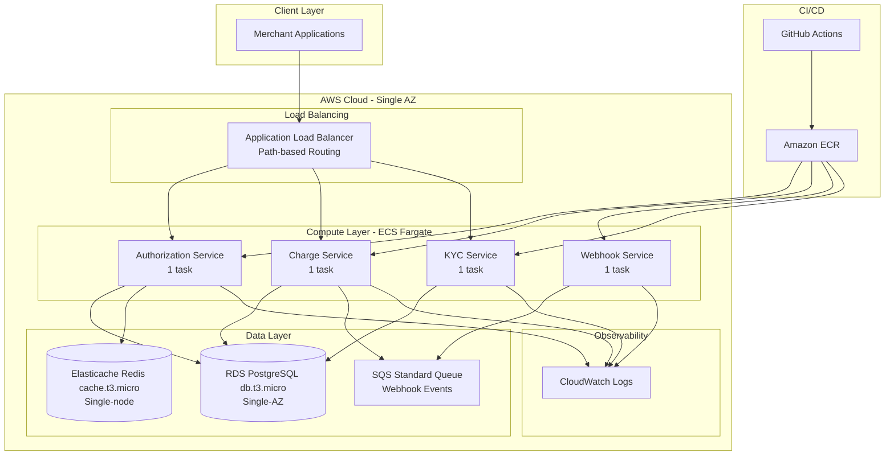

# Design Document: NovaPay Microservices Migration

## Overview

This design document specifies the technical architecture for migrating NovaPay from a single-instance monolithic application to a cost-optimized microservices architecture on AWS for PoC and learning purposes. This is a minimal viable implementation designed for internal learning and experimentation, NOT production use.

### Current State Analysis

The existing monolith (`server.js`) exhibits several architectural limitations that prevent horizontal scaling and create availability risks:

1. **In-process state management**: Idempotency keys stored in `Map` and webhook events in an array are lost during restarts and cannot be shared across instances
2. **Noisy neighbor problem**: CPU-intensive KYC validation blocks the event loop, degrading performance for payment operations
3. **Single point of failure**: Running on one EC2 instance with no redundancy
4. **Webhook reliability**: In-memory queue loses events on crash or restart

### Migration Goals

The target architecture decomposes the monolith into four independent microservices and externalizes stateful components using minimal AWS infrastructure:

- **Authorization Service**: Card authorization with externalized idempotency (single-node Redis)
- **Charge Service**: Payment capture and refunds with durable webhook publishing (SQS)
- **Webhook Service**: Asynchronous webhook delivery with retry logic
- **KYC Service**: Isolated CPU-intensive validation preventing noisy neighbor issues

### Key Design Decisions

**Cost-Optimized for PoC**: This architecture prioritizes learning and cost minimization over production-grade availability. Single-AZ deployment, minimal instance sizes, and simplified infrastructure make this suitable for internal experimentation with low transaction volumes.

**Single-AZ Deployment**: All resources run in a single availability zone to eliminate cross-AZ data transfer costs and NAT Gateway costs. Public subnets for ECS tasks avoid NAT Gateway entirely.

**Minimal Scaling**: Each service runs 1 task with no autoscaling. This teaches microservices patterns without the complexity and cost of horizontal scaling.

**Direct Connections**: Services connect directly to RDS and Redis without RDS Proxy, reducing costs and complexity.

**Simple Deployment**: Rolling updates replace blue-green deployment. Environment variables replace Secrets Manager.

**Infrastructure as Code**: All resources defined in Terraform for reproducibility and auditability.

## Architecture

### High-Level Architecture Diagram



### Service Decomposition Strategy

The monolith is decomposed along functional boundaries with clear separation of concerns:

1. **Authorization Service** (`/auth` endpoint)
   - Handles card authorization requests
   - Manages idempotency using external Redis cache
   - Generates transaction tokens
   - Stateless design enables horizontal scaling

2. **Charge Service** (`/charge`, `/refund` endpoints)
   - Handles payment capture and refund operations
   - Publishes webhook events to SQS instead of in-memory queue
   - Updates transaction status in shared database
   - Stateless design enables horizontal scaling

3. **Webhook Service** (background worker)
   - Consumes webhook events from SQS
   - Delivers webhooks to merchant endpoints with retry logic
   - Implements exponential backoff with jitter
   - Isolated from request path to prevent noisy neighbor issues

4. **KYC Service** (`/kyc` endpoint)
   - Handles CPU-intensive validation operations
   - Isolated from payment-critical services
   - Can scale independently based on KYC load
   - Prevents event loop blocking in other services

### Network Architecture

**VPC Configuration**:
- VPC in single availability zone (us-east-1a)
- Public subnets: ALB and ECS tasks (no NAT Gateway needed)
- Private subnets: RDS and Elasticache (isolated from internet)

**Security Groups**:
- ALB SG: Inbound 443 from 0.0.0.0/0, outbound to ECS SG
- ECS SG: Inbound from ALB SG on container ports, outbound to RDS/Redis/internet
- RDS SG: Inbound 5432 from ECS SG only
- Redis SG: Inbound 6379 from ECS SG only

**Cost Optimization Notes**:
- Public subnets for ECS eliminate NAT Gateway costs ($32/month)
- Single-AZ deployment eliminates cross-AZ data transfer costs
- ECS tasks get public IPs for outbound webhook delivery

## Components and Interfaces

### Authorization Service

**Responsibilities**:
- Process card authorization requests
- Enforce idempotency using external cache
- Generate unique transaction tokens
- Persist authorization records to database

**API Contract**:
```typescript
POST /auth
Request: {
  card: string,           // Card number (PCI-compliant handling required)
  amount: number,         // Amount in cents
  merchantId: string,     // Merchant identifier
  idempotencyKey: string  // Client-provided idempotency key
}

Response 200: {
  token: string,          // Transaction token for capture
  status: "AUTHORIZED",
  amount: number
}

Response 503: {
  error: "Service Unavailable",
  message: "Idempotency store unavailable"
}
```

**Dependencies**:
- RDS PostgreSQL (database writes, direct connection)
- Elasticache Redis (idempotency checks, direct connection)
- AWS Systems Manager Parameter Store (database credentials)

**Idempotency Flow**:
1. Check Redis for `idempotencyKey`
2. If exists, return cached response (200ms timeout)
3. If not exists, generate token and insert into RDS
4. Store response in Redis with 24-hour TTL
5. Return response to client

**Timeout Configuration**:
- Redis timeout: 200ms
- Database timeout: 500ms

### Charge Service

**Responsibilities**:
- Process payment capture requests
- Process refund requests
- Publish webhook events to SQS
- Update transaction status in database

**API Contracts**:
```typescript
POST /charge
Request: {
  token: string  // Transaction token from authorization
}

Response 200: {
  ok: true
}

POST /refund
Request: {
  token: string,
  amount: number  // Refund amount in cents
}

Response 200: {
  ok: true,
  refunded: number
}
```

**Dependencies**:
- RDS PostgreSQL (database updates, direct connection)
- SQS Standard Queue (webhook publishing)
- AWS Systems Manager Parameter Store (database credentials)

**Webhook Publishing Flow**:
1. Update transaction status in RDS (500ms timeout)
2. Publish event to SQS Standard Queue
3. Return success response
4. SQS guarantees at-least-once delivery to Webhook Service

### Webhook Service

**Responsibilities**:
- Poll SQS for webhook events
- Deliver webhooks to merchant endpoints
- Implement retry logic with exponential backoff
- Move failed messages to dead-letter queue after 5 attempts

**Processing Flow**:
1. Long-poll SQS (20-second wait time)
2. Receive batch of up to 10 messages
3. For each message:
   - Extract merchant webhook URL from database
   - POST event to merchant endpoint (5-second timeout)
   - If success (2xx response), delete message from SQS
   - If failure, return message to queue (visibility timeout increases)
4. After 5 failed attempts, SQS moves message to DLQ

**Retry Configuration**:
- Initial visibility timeout: 1 second
- Backoff multiplier: 2x with jitter (±20%)
- Maximum visibility timeout: 60 seconds
- Maximum receive count: 3
- Dead-letter queue retention: 14 days

**Dependencies**:
- SQS Standard Queue (event consumption)
- RDS PostgreSQL (merchant configuration lookup, direct connection)
- Merchant HTTP endpoints (webhook delivery)

### KYC Service

**Responsibilities**:
- Validate SSN format using regex
- Isolated CPU-intensive operations
- No shared state with other services

**API Contract**:
```typescript
POST /kyc
Request: {
  ssn: string  // Social Security Number
}

Response 200: {
  valid: boolean
}
```

**Dependencies**:
- None (stateless validation)

**Isolation Benefits**:
- CPU-intensive regex does not block payment operations
- Can scale independently based on KYC load
- Failures do not impact payment processing

### Application Load Balancer

**Routing Rules**:
```
Priority 1: /auth      → Authorization Service Target Group
Priority 2: /charge    → Charge Service Target Group
Priority 3: /refund    → Charge Service Target Group
Priority 4: /kyc       → KYC Service Target Group
Priority 5: /health    → All Service Target Groups (health checks)
```

**Health Check Configuration**:
- Endpoint: `GET /health`
- Interval: 30 seconds
- Timeout: 5 seconds
- Healthy threshold: 2 consecutive successes
- Unhealthy threshold: 2 consecutive failures
- Expected response: HTTP 200

**Connection Draining**:
- Deregistration delay: 60 seconds
- Allows in-flight requests to complete before task termination

### RDS PostgreSQL Database

**Configuration**:
- Instance class: db.t3.micro (2 vCPU, 1 GB RAM)
- Engine: PostgreSQL 15
- Storage: 20 GB gp3
- Multi-AZ: Disabled (single-AZ for cost optimization)
- Automated backups: Enabled (7-day retention)
- Encryption at rest: Enabled (AWS KMS)

**Connection Management**:
- Services connect directly to RDS (no RDS Proxy)
- Each service maintains connection pool (min: 2, max: 10)
- Connection timeout: 500ms
- Idle connection timeout: 5 minutes

**Credentials**:
- Stored in AWS Systems Manager Parameter Store as SecureString
- Parameters:
  - `/novapay/rds/username`
  - `/novapay/rds/password`
  - `/novapay/rds/host`
  - `/novapay/rds/database`
- Services retrieve at startup using AWS SDK
- Encrypted using AWS KMS (default key)

**Cost Optimization Notes**:
- Single-AZ reduces costs by ~50% vs Multi-AZ
- db.t3.micro suitable for low transaction volumes (< 100 TPS)
- No RDS Proxy eliminates $15/month cost
- Parameter Store Standard is free (vs Secrets Manager $0.40/secret/month)

### Elasticache Redis Cache

**Configuration**:
- Engine: Redis 7.x
- Mode: Single-node (no cluster mode)
- Node type: cache.t3.micro (2 vCPU, 0.5 GB RAM)
- Multi-AZ: Disabled (single-node for cost optimization)
- Encryption in transit: TLS 1.2
- Automated snapshots: Enabled (7-day retention)

**Connection Management**:
- Authorization Service connects directly to Redis
- Connection pooling handled by Redis client library
- Timeout: 200ms per operation

**Data Model**:
```
Key: idempotency:{idempotencyKey}
Value: JSON-serialized response
TTL: 86400 seconds (24 hours)
```

**Cost Optimization Notes**:
- Single-node eliminates replica costs
- cache.t3.micro suitable for low idempotency check volumes
- No automatic failover (acceptable for PoC learning environment)

### SQS Standard Queue

**Configuration**:
- Queue type: Standard (not FIFO for cost optimization)
- Visibility timeout: 30 seconds (initial)
- Message retention: 14 days
- Dead-letter queue: Enabled after 3 receive attempts
- Receive message wait time: 20 seconds (long polling)

**Message Format**:
```json
{
  "token": "abc123def456",
  "event": "captured",
  "merchantId": "m_42",
  "timestamp": "2024-01-15T10:30:00Z"
}
```

**Cost Optimization Notes**:
- Standard queue is free tier eligible (1M requests/month)
- FIFO queue costs $0.50 per million requests
- Message ordering not critical for webhook delivery

### ECS Fargate Cluster

**Task Configuration**:
- CPU: 0.25 vCPU per task
- Memory: 0.5 GB per task
- Launch type: Fargate (serverless)
- Platform version: LATEST
- Network mode: awsvpc

**Service Configuration**:
- Desired count: 1 task per service (no autoscaling)
- Deployment type: Rolling update (ECS native)
- Health check grace period: 60 seconds
- Deployment configuration:
  - Minimum healthy percent: 0 (allows task replacement)
  - Maximum percent: 200 (allows new task before stopping old)

**Task Placement**:
- Single availability zone (us-east-1a)
- Public subnet with public IP assignment

**Cost Optimization Notes**:
- 1 task per service eliminates autoscaling complexity
- 0.25 vCPU / 0.5 GB suitable for low traffic PoC
- Rolling updates simpler than blue-green deployment

## Data Models

### Database Schema

The existing `txns` table is preserved for backward compatibility:

```sql
CREATE TABLE txns (
  id TEXT PRIMARY KEY,              -- Transaction token
  merchant TEXT NOT NULL,           -- Merchant identifier
  amount NUMERIC(10,2) NOT NULL,    -- Amount in cents
  status TEXT NOT NULL,             -- AUTHORIZED | CAPTURED | REFUNDED
  created_at TIMESTAMPTZ DEFAULT now(),
  updated_at TIMESTAMPTZ DEFAULT now()
);

CREATE INDEX idx_txns_merchant ON txns(merchant);
CREATE INDEX idx_txns_status ON txns(status);
CREATE INDEX idx_txns_created_at ON txns(created_at);
```

**Migration Strategy**:
- Schema remains unchanged during initial migration
- Future enhancements may add columns (e.g., `refund_amount`, `webhook_status`)
- Migrations applied via Flyway or Liquibase before service deployment
- Backward-compatible changes only (additive, not destructive)

### Redis Data Model

**Idempotency Cache**:
```
Key Pattern: idempotency:{idempotencyKey}
Value: JSON string
TTL: 86400 seconds (24 hours)

Example:
Key: idempotency:k1
Value: {"token":"abc123","status":"AUTHORIZED","amount":4999}
TTL: 86400
```

**Cache Eviction**:
- Automatic expiration after 24 hours
- LRU eviction if memory limit reached (unlikely with proper sizing)

### SQS Message Model

**Webhook Event Message**:
```json
{
  "token": "abc123def456",
  "event": "captured",
  "merchantId": "m_42",
  "timestamp": "2024-01-15T10:30:00Z"
}
```

### Environment Variables

**Redis Connection**:
```
REDIS_URL=redis://host:6379
REDIS_TLS=true
```

**Configuration Notes**:
- Redis connection details stored in Parameter Store:
  - `/novapay/redis/host`
  - `/novapay/redis/port`
- Database credentials stored in Parameter Store (see RDS section)
- No Secrets Manager (eliminates $0.40/secret/month cost)
- Parameter Store Standard is free for up to 10,000 parameters
- Suitable for PoC learning environment

## Error Handling

### Service-Level Error Handling

**Authorization Service**:
- Redis unavailable (timeout > 200ms): Return HTTP 503
- Database unavailable (timeout > 500ms): Return HTTP 503
- Invalid request (missing fields): Return HTTP 400 with validation errors
- Duplicate idempotency key: Return cached response (HTTP 200)

**Charge Service**:
- Database unavailable: Return HTTP 503
- SQS unavailable: Return HTTP 503 (webhook publishing failed)
- Invalid token (not found in database): Return HTTP 404
- Invalid request: Return HTTP 400

**Webhook Service**:
- Merchant endpoint timeout (> 5 seconds): Retry with exponential backoff
- Merchant endpoint returns 4xx: Move to DLQ after 3 attempts (client error)
- Merchant endpoint returns 5xx: Retry with exponential backoff
- SQS unavailable: Log error and retry polling after 30 seconds

**KYC Service**:
- Invalid request: Return HTTP 400
- No external dependencies, minimal error surface

### Retry Logic

**Webhook Delivery Retries**:
- Strategy: Exponential backoff with jitter
- Initial delay: 1 second
- Backoff multiplier: 2x
- Jitter: ±20% random variation
- Maximum delay: 60 seconds
- Maximum attempts: 3
- After 3 failures: Move to dead-letter queue

**Retry Schedule**:
```
Attempt 1: Immediate
Attempt 2: ~1 second (0.8-1.2s with jitter)
Attempt 3: ~2 seconds (1.6-2.4s with jitter)
After 3: Move to DLQ
```

**Database Connection Retries**:
- Client libraries implement connection retry with exponential backoff
- Max retries: 3
- Initial delay: 100ms
- Backoff multiplier: 2x

### Graceful Degradation

**Authorization Service**:
- If Redis unavailable: Return HTTP 503 (cannot guarantee idempotency)
- If database unavailable: Return HTTP 503 (cannot persist authorization)
- No graceful degradation possible (both dependencies critical)

**Charge Service**:
- If database unavailable: Return HTTP 503 (cannot update transaction)
- If SQS unavailable: Return HTTP 503 (cannot guarantee webhook delivery)
- No graceful degradation possible (both dependencies critical)

**Webhook Service**:
- If merchant endpoint unavailable: Retry with backoff, eventual DLQ
- If SQS unavailable: Pause polling, retry after 30 seconds
- Graceful degradation: Delayed webhook delivery acceptable

### Logging and Monitoring

**Structured Logging Format**:
```json
{
  "timestamp": "2024-01-15T10:30:00.123Z",
  "level": "ERROR",
  "service": "authorization-service",
  "traceId": "abc123def456",
  "message": "Redis timeout exceeded",
  "error": {
    "type": "TimeoutError",
    "message": "Operation timed out after 200ms",
    "stack": "..."
  },
  "context": {
    "idempotencyKey": "k1",
    "operation": "redis.get"
  }
}
```

**CloudWatch Logs**:
- All services emit structured JSON logs to CloudWatch Logs
- Log retention: 7 days (cost optimization)
- No custom dashboards or alarms (basic monitoring only)

## Testing Strategy

This migration involves Infrastructure as Code (Terraform), AWS service configuration, and distributed systems integration. Property-based testing is not applicable for this type of project. The testing strategy focuses on simplified validation suitable for a PoC learning environment:

### Unit Tests

**Service Logic Tests**:
- Authorization Service: Idempotency key handling, token generation
- Charge Service: Transaction status updates, webhook event formatting
- Webhook Service: Retry logic, exponential backoff calculation
- KYC Service: SSN validation regex

**Mock-Based Tests**:
- Mock Redis client for idempotency tests
- Mock PostgreSQL client for database operations
- Mock SQS client for webhook publishing
- Mock HTTP client for webhook delivery

**Example Test Cases**:
- Authorization with new idempotency key creates transaction
- Authorization with existing idempotency key returns cached response
- Charge updates transaction status and publishes SQS message
- Webhook delivery retries with exponential backoff on failure

### Integration Tests

**Service Integration Tests**:
- Authorization Service → RDS PostgreSQL (direct connection)
- Authorization Service → Elasticache Redis (direct connection)
- Charge Service → SQS Standard Queue
- Webhook Service → SQS → Merchant HTTP endpoint (mock)

**Infrastructure Integration Tests**:
- ALB health checks detect unhealthy tasks
- ECS rolling updates complete successfully
- Database connections work with connection pooling

**Test Environment**:
- Dedicated AWS account for integration testing
- Terraform applies same infrastructure as production
- Automated teardown after test completion

### End-to-End Tests

**Critical User Flows**:
1. Authorization → Charge → Webhook delivery (happy path)
2. Duplicate authorization with same idempotency key
3. Authorization with Redis unavailable (timeout handling)
4. Webhook delivery with merchant endpoint failure (retry logic)
5. Service deployment with rolling update

### Infrastructure Tests

**Terraform Validation**:
- `terraform validate`: Syntax and configuration validation
- `terraform plan`: Dry-run to detect drift
- `tflint`: Linting for best practices and security issues

**Policy Tests**:
- AWS Config rules: Encryption enabled
- IAM policy validation: Least privilege enforcement
- Security group rules: No unrestricted ingress

### Smoke Tests

**Post-Deployment Validation**:
- Health endpoints return HTTP 200
- Authorization creates transaction in database
- Charge publishes message to SQS
- Webhook service consumes message from SQS
- CloudWatch logs contain structured JSON

**Automated Smoke Test Suite**:
- Runs automatically after each deployment
- Validates basic functionality

### Backward Compatibility Tests

**API Contract Tests**:
- Microservice responses match monolith responses
- Same request produces identical results
- Idempotency behavior identical between monolith and microservice

### Test Automation

**CI/CD Pipeline Tests**:
- Unit tests run on every commit
- Integration tests run on every PR
- Smoke tests run after deployment

**Test Coverage Requirements**:
- Unit test coverage: ≥ 70% for service logic
- Integration test coverage: All critical paths
- End-to-end test coverage: All user-facing flows

---

## Design Review

This design document specifies a cost-optimized architecture for migrating NovaPay from a monolithic application to a microservices architecture on AWS for PoC and learning purposes. Key design decisions include:

1. **Service decomposition** into Authorization, Charge, Webhook, and KYC services with clear boundaries
2. **Externalized state** using single-node Redis (idempotency) and SQS Standard (webhooks)
3. **Single-AZ deployment** with db.t3.micro RDS and cache.t3.micro Redis for cost optimization
4. **Direct connections** to RDS and Redis (no RDS Proxy) for simplicity
5. **Public subnets for ECS** to eliminate NAT Gateway costs
6. **Rolling updates** for simple deployment without blue-green complexity
7. **AWS Systems Manager Parameter Store** for credentials (free, no Secrets Manager cost)
8. **Basic CloudWatch Logs** for observability (no dashboards or alarms)
9. **Infrastructure as Code** with Terraform for reproducibility

This architecture teaches core microservices patterns (service decomposition, externalized state, async messaging) while minimizing AWS costs for internal learning and experimentation.